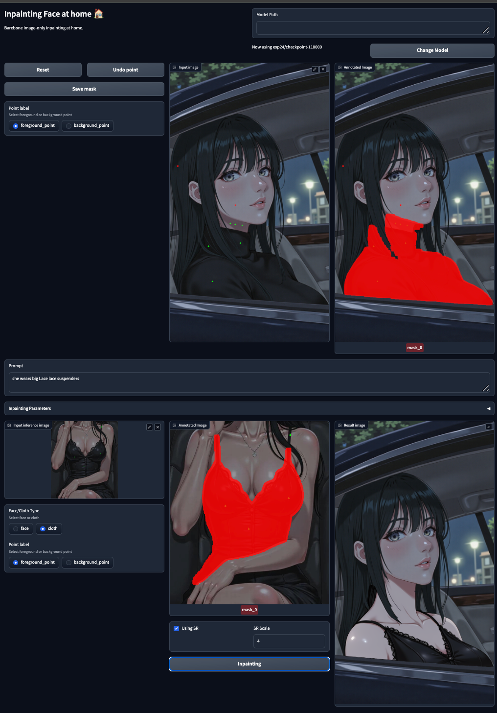
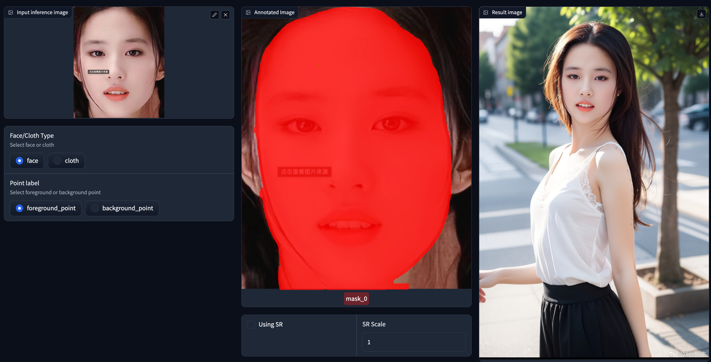
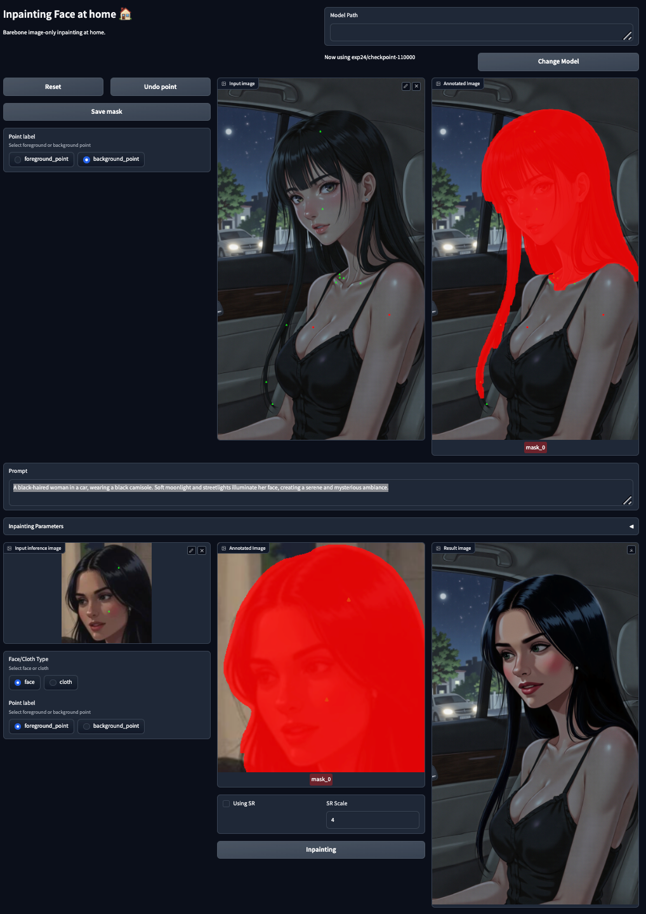

# Dataset
## Data Processing Pipeline

cd data_process

### Step1: Lang_sam, Obtain segmentation of characters in images.

```cd data_process & python lang_sam.py --dataset_root_path xxx --gpu_list 0,1,2,3,4,5,6,7```

### Step2:Detect_skeleton

```cd data_process & python skeleton_detect.py --dataset_root_path xxx --gpu_list 0,1,2,3,4,5,6,7```

### Step3:Detect_skeleton

```cd data_process & python skeleton_detect.py --dataset_root_path xxx --gpu_list 0,1,2,3,4,5,6,7```

### Step3:face_parser(真人)

```cd data_process & python face_parse_real.py --dataset_root_path xxx```

- Notes​​:
The dataset_root_path must contain an img folder with images (multi-level subdirectories allowed).

- ​Parameters​​:
--total_segments: Number of segments to split the dataset into.
--which_segment: Index of the segment to process.


### Step4:sapiens_seg

```cd sapiens/seg && bash seg.sh```

Modify INPUT, OUTPUT, and VALID_GPU_IDS in the script.

### Step4:sapiens_skeleton

```cd sapiens/pose && bash keypoints308.sh```
Modify INPUT, OUTPUT, and VALID_GPU_IDS in the script.

## 训练数据
- vcg_122w [no image], 467725
  - https://pan.baidu.com/s/1tuy5hYuYh-k3FDtgp4Vrmw?pwd=yhew 提取码: yhew 
- vcg_images_80w [no image], 123529
  - https://pan.baidu.com/s/12wY4t3EnihINTtIhMCSsWg?pwd=ujb9 提取码: ujb9 
- vcg_reelshort_0_200 [no image], 129446
  - https://pan.baidu.com/s/1NtSTz9LENzCrFWn1Ce9f-A?pwd=jqsr 提取码: jqsr 
- vcg_chat_history_0_300_two_people  [no image], 117416
  - https://pan.baidu.com/s/1_KgaiTc0G9WFVPk93hIpIw?pwd=kcgr 提取码: kcgr 
- flux_img_78_all [with image], 95798
  - https://pan.baidu.com/s/1zP5ZIrjzd76yWmPgCxgbLg?pwd=gmse 提取码: gmse 
- flux_anime_1character [with image], 61847
  - https://pan.baidu.com/s/1Y-jA0PhwEpUeNXDeMXn7_A?pwd=nani 提取码: nani 
- flux_anime_2characters [with image], 41357
  - https://pan.baidu.com/s/1yM2KkJTQuFODNJN3QGxiIg?pwd=c253 提取码: c253 
- anime_pictures_46w [no image], 423535
  - https://pan.baidu.com/s/1U61GOFYUtZemqJz7_9WEaQ?pwd=wa9x 提取码: wa9x 
- danbooru_anime [no image], 82947
  - https://pan.baidu.com/s/1U61GOFYUtZemqJz7_9WEaQ?pwd=wa9x 提取码: wa9x 
- tuchong

### Note:
1. For datasets ​​vcg_122w​​, ​​vcg_images_80w​​, ​​vcg_reelshort_0_200​​, ​​vcg_chat_history_0_300_two_people​​, ​​anime_pictures_46w​​, and ​​danbooru_anime​​, email wxktongji@163.com to request images (include your identity/purpose).
2. Dataset directory structure after decompression:

```|-- anime_pictures_46w
|   |-- caption
|   |-- img
|   |-- json_w_face_body
|   |-- mask
|   |-- mask_sapiens
|   `-- skeleton_sapiens_308
|-- danbooru_anime
|   |-- caption
|   |-- img
|   |-- json_w_face
|   |-- mask
|   `-- skeleton_sapiens_308
|-- flux_anime_1character
|   |-- caption
|   |-- img
|   |-- json_w_face
|   |-- mask_sapiens
|   |-- skeleton
|   `-- skeleton_sapiens_308
|-- flux_anime_2characters
|   |-- caption
|   |-- img
|   |-- json_w_face
|   |-- mask
|   |-- mask_sapiens
|   `-- skeleton_sapiens_308
|-- flux_img_78_all
|   |-- caption
|   |-- face_embedding
|   |-- img
|   |-- json_final
|   |-- mask
|   |-- mask_sapiens
|   |-- skeleton_sapiens
|   `-- skeleton_sapiens_308
|-- vcg_122w
|   |-- caption
|   |-- face_embedding
|   |-- img
|   |-- mask
|   |-- mask_sapiens
|   |-- skeleton_sapiens
|   `-- json_final
|-- vcg_chat_history_0_300_two_people
|   |-- caption
|   |-- face_embedding
|   |-- img
|   |-- json_final
|   |-- mask
|   |-- mask_sapiens
|   `-- skeleton_sapiens
|-- vcg_images_80W
|   |-- caption
|   |-- face_embedding
|   |-- img
|   |-- json_final
|   |-- mask
|   |-- mask_sapiens
|   |-- origin
|   `-- skeleton_sapiens
`-- vcg_reelshort_0_200
    |-- caption
    |-- face_embedding
    |-- img
    |-- json_final
    |-- mask
    |-- mask_sapiens
    `-- skeleton_sapiens
```

## Validation Data

We have prepared several cases of real people/anime, face-changing or costume changing. 
Directory: ./valid_data. Please remaining structure unchanged

```|-- mask
|   |-- clothes
|   `-- face
|-- origin
|   |-- clothes
|   `-- face
|-- process_img
|   |-- face_bbox
|   |-- img
|   |-- json
|   |-- mask
|   |-- mask_sapiens
|   |-- skeleton
|   `-- skeleton_sapiens_308
|-- process_img_reference
|   |-- img
|   |-- json
|   |-- mask
|   |-- mask_sapiens
|   |-- skeleton
|   `-- skeleton_sapiens_308
`-- reference
    |-- clothes
    `-- face
```

# Model

FLUX-Inpainting-IPA-face： https://pan.baidu.com/s/1N5gY0GfjXroMyv6DwYw7bw?pwd=p23s 提取码: p23s 

FLUX-Inpainting-IPA-cloth： https://pan.baidu.com/s/1BKQHrN1Irocs5iHSm43yfA?pwd=8bst 提取码: 8bst 

antelopev2：https://pan.baidu.com/s/1rDxuSv9FSYiB-sQJm4tmlA?pwd=8p9x 提取码: 8p9x 

CurricularFace：https://pan.baidu.com/s/15AIykSXedKYe9qOqdAHcMQ?pwd=nawi 提取码: nawi 

dinov2_vitg14：https://pan.baidu.com/s/1cl1YPyvUFh24lL7P-ESZfg?pwd=wdrm 提取码: wdrm 

## Model directory structure​​:
```|-- CurricularFace
|   `-- CurricularFace_Backbone.pth
|-- antelopev2
|   `-- glintr100.onnx
|-- checkpoint-cloth
|   |-- ip_adaptor.safetensors
|   |-- ip_adaptor_controlnet.safetensors
|   `-- ip_adaptor_project.safetensors
`-- checkpoint-face
    |-- ip_adaptor.safetensors
    |-- ip_adaptor_controlnet.safetensors
    `-- ip_adaptor_project.safetensors
```

# Environment

```conda env create -f environment.yml```

# Train

```python3 train_flux_deepspeed_inpainting_ipa.py
CUDA_VISIBLE_DEVICES=0,1,2,3,4,5,6,7 accelerate launch \
    --config_file accelerate_deepspeed_bf16.yaml \
    --main_process_port 30090 \
    --num_processes 8 \
    train_flux_deepspeed_inpainting_ipa.py \
    --config "train_configs/inpaint_cloth.yaml"
```

# Evalution

```python3 valid_training.py```

# Results

- cloth try on


- face sweap
1. case1

2. case2


- face sweap + cloth try on
